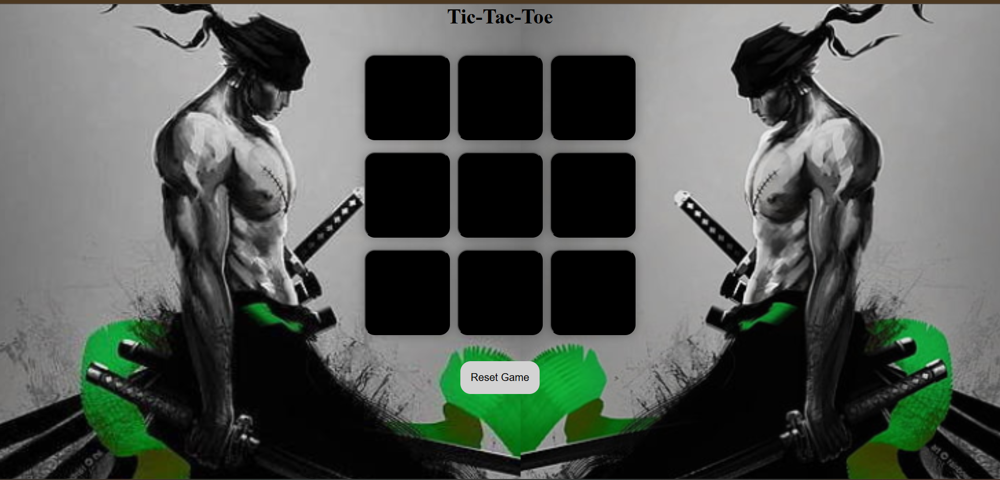

## Tic-Tac-Toe

A simple and interactive Tic-Tac-Toe game built using **HTML**, **CSS**, and **JavaScript**. This project is perfect for beginners learning web development and aims to showcase fundamental web development skills.

---

## Features

- **Player vs. Player Mode**: Two players can take turns to play the game.
- **Dynamic UI**: Visual feedback for player turns and win/loss/draw states.
- **Responsive Design**: Adapts to different screen sizes and devices.
- **Restart Option**: Reset the game board at any time for a new match.

---

## Demo

### [Live Demo](#) *(https://nikhilcigmallu.github.io/Tic-Tac-Toe/)*

---

## Screenshots

## Technologies Used

- **HTML**: To structure the game layout.
- **CSS**: For styling and enhancing the visual appeal of the game.
- **JavaScript**: To implement game logic and interactivity.

---

## How to Play

1. Open the game in your browser.
2. Player 1 (X) and Player 2 (O) take turns clicking on empty squares on the grid.
3. The first player to align three of their marks (horizontally, vertically, or diagonally) wins.
4. If all squares are filled and no player has won, the game ends in a draw.
5. Use the "Restart" button to play a new game.

---

## Getting Started

### Prerequisites

To run this project, you need:

- A web browser (e.g., Chrome, Firefox, or Edge).
- Basic knowledge of HTML, CSS, and JavaScript (helpful for understanding the code).
